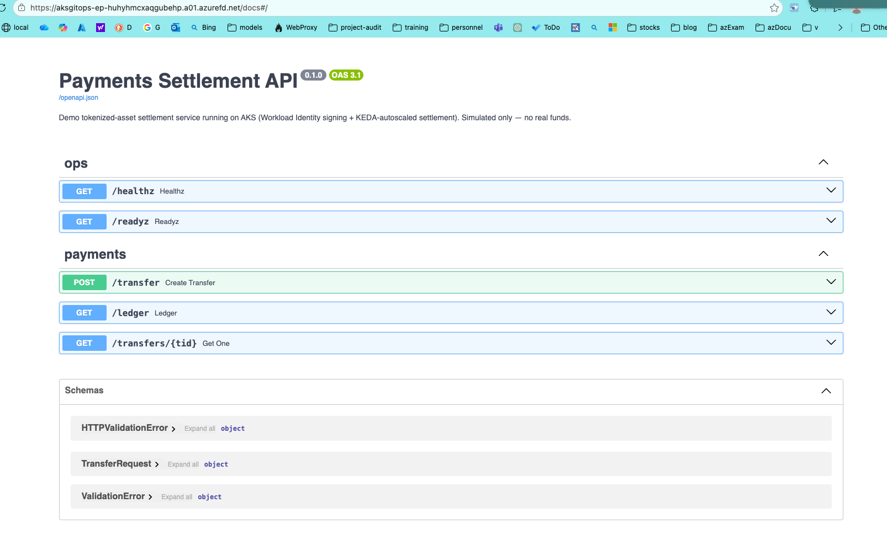
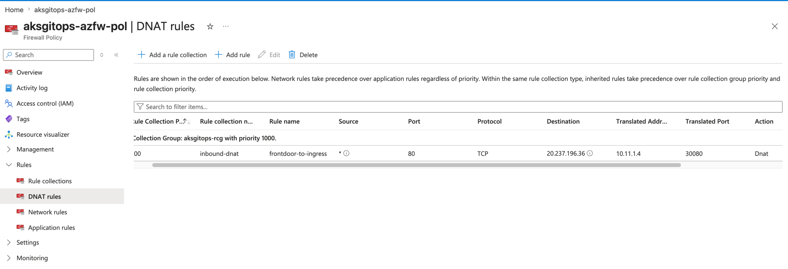
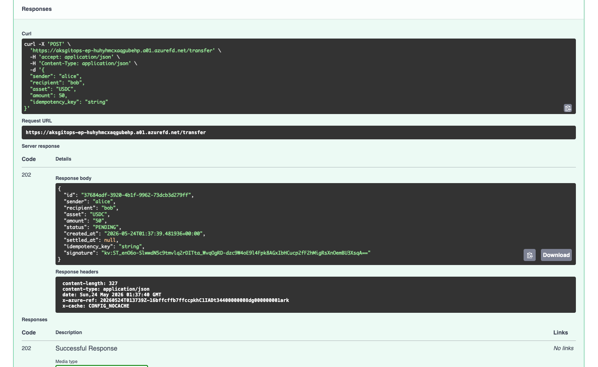
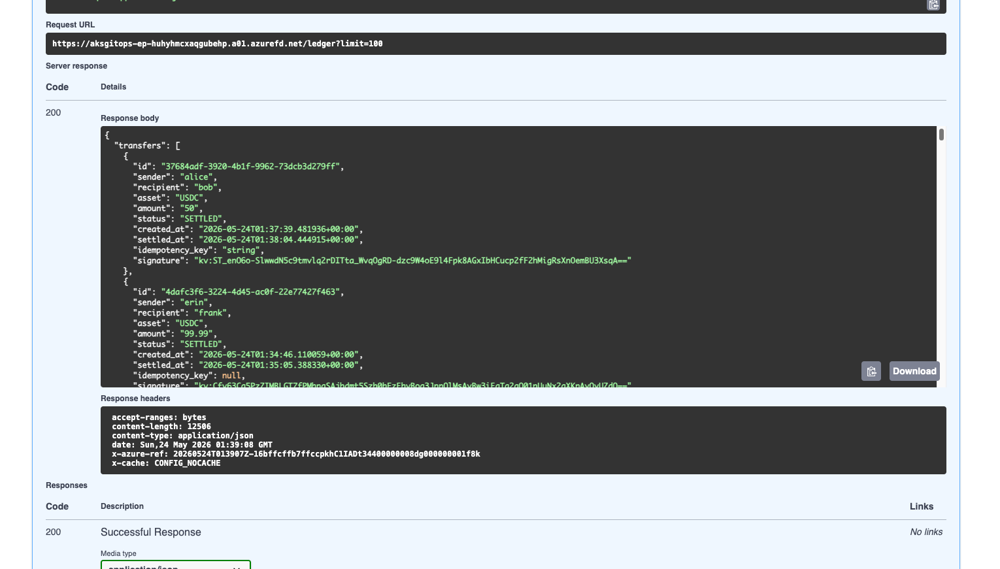

# aks-gitops-platform

A hands-on Azure platform-engineering lab: a Terraform-provisioned **AKS** cluster running a full **GitOps + event-driven autoscaling** stack, fronted by a production-style **secure ingress** (Front Door → Azure Firewall → ingress-nginx) and reaching PaaS over **private endpoints**.



## What it demonstrates

- **Secure public ingress** — Azure **Front Door** (global edge, managed TLS) → Azure **Firewall** (DNAT) → `ingress-nginx` → app, with an **`X-Azure-FDID` origin lock** so nobody can bypass the edge
- **Forced-tunnel egress** — AKS `outbound_type=userDefinedRouting`; all node egress is routed through the firewall (hub-spoke + UDR)
- **Private Endpoint** — Key Vault is reached over a private endpoint + private DNS; that traffic never touches the firewall
- **Workload Identity** — pods sign/read in Key Vault via OIDC federation, with **no stored credentials**
- **Azure CNI Overlay + Cilium** — pod IPs decoupled from VNet space, eBPF dataplane
- **KEDA** — scaling a worker off Azure Service Bus queue depth, including **scale-to-zero**
- **ArgoCD** — GitOps: this repo is the source of truth and the cluster reconciles to it
- **Terraform** — all Azure infrastructure as code, organized into reusable modules
- **Payments settlement app** — a demo service that ties it together: signs transfers with a Key Vault key via Workload Identity, then settles them on a KEDA-autoscaled worker

## Architecture — secure ingress

```
                         Internet (users)
                                │  HTTPS  (Front Door managed cert; HTTP auto-upgraded)
                                ▼
                  ┌─────────────────────────────┐
                  │   Azure Front Door (Std)     │  global edge · WAF-ready · x-azure-ref
                  └─────────────────────────────┘
                                │  HTTP:80   origin = firewall public IP
                                ▼
  HUB VNet 10.10.0.0/24   ┌─────────────────────────────┐
                          │   Azure Firewall (Basic)     │  DNAT in · L4 egress out
                          │   AzureFirewallSubnet /26     │  private IP 10.10.0.4
                          └─────────────────────────────┘
              DNAT :80 → 10.11.1.4:30080  │            ▲  0.0.0.0/0 via UDR
                                          ▼            │  (node egress forced here)
  SPOKE VNet 10.11.0.0/16  (peered to hub)
     ├── subnet aks-nodes 10.11.1.0/24    nodes .4/.5      ← NodePort 30080
     └── subnet peSubnet  10.11.4.0/24    Key Vault PE .4
                                          │
                                          ▼
  ┌──────────────────────────────────────────────────────────────────────┐
  │  AKS  aksgitops-aks      CNI Overlay + Cilium · OIDC/Workload Identity │
  │    outbound_type = userDefinedRouting (egress via the hub firewall)    │
  │    Pod CIDR 10.244.0.0/16 (overlay)    Service CIDR 10.0.0.0/16        │
  │                                                                        │
  │    ingress-nginx (NodePort) ──► payments-api ──► Service Bus ──► KEDA  │
  │      └─ X-Azure-FDID origin lock (rejects non-Front-Door traffic, 403) │
  └──────────────────────────────────────────────────────────────────────┘
        │ Workload Identity (private endpoint)        │ KEDA poll / AMQP (5671, public)
        ▼                                             ▼
  ┌───────────────────────────────┐         ┌──────────────────────────────┐
  │ Key Vault (private endpoint)  │         │ Service Bus > demo-queue     │
  │   privatelink.vaultcore →     │         │   Basic SKU (no Private Link;│
  │   10.11.4.4  (in-VNet)        │         │   reached via firewall :5671)│
  │   key: tx-signer (sign/verify)│         └──────────────────────────────┘
  └───────────────────────────────┘
```

**Request lifecycle (in order — this is the current build):**

1. **User → Front Door** over HTTPS (Front Door's managed cert; plain HTTP is auto-upgraded).
2. **Front Door → firewall public IP** over HTTP:80 — the firewall's public IP is Front Door's configured origin.
3. **Azure Firewall DNAT** translates `:80` to the ingress **NodePort** on a node (`10.11.1.4:30080`).
4. **ingress-nginx** checks **`X-Azure-FDID`** — only *this* Front Door's ID is served; anything else gets **403**, so hitting the firewall IP directly fails.
5. **payments-api** signs the transfer with the **Key Vault key over the private endpoint** (Workload Identity — no secret in the pod), writes `PENDING` to **Redis**, and enqueues to **Service Bus** (`5671`, public — Basic SKU has no Private Link).
6. **KEDA** sees the queue depth and scales **settlement-worker 0 → N**.
7. **worker** verifies the signature, settles, writes `SETTLED` to Redis; when idle, KEDA scales it **back to 0**.
8. **Return + other egress** flow back through the firewall — the spoke subnet routes `0/0` to the firewall (forced-tunnel egress).

**Three flows worth tracing:**

1. **Secure ingress + origin lock.** Front Door terminates TLS at the edge and forwards to its origin — the firewall's public IP. The firewall DNATs `:80` to the ingress NodePort. `ingress-nginx` then **403s any request missing this Front Door's `X-Azure-FDID`**, so hitting the firewall IP directly fails. Return traffic is symmetric because the spoke routes `0/0` back through the firewall.
2. **Workload Identity (no secrets).** A pod's ServiceAccount token is federated (OIDC) to an Azure managed identity and exchanged for an Entra token to **sign with a Key Vault key** — over the **private endpoint**, in-VNet. Nothing is stored in the cluster.
3. **Event-driven scaling.** KEDA watches `demo-queue` depth and scales the `settlement-worker` 0→N→0, including scale-to-zero when idle.

> Pod IPs (`10.244.0.0/16`) are an **overlay** — they don't consume VNet space. PaaS that supports Private Link (Key Vault) is reached privately; Service Bus **Basic** cannot have a private endpoint (Premium-only), so it is reached over the firewall on `5671`.

## Sandbox adaptations (and what prod would do)

This was built and validated in a locked-down sandbox (a custom role that **denies role assignments and provider registration**, and an Azure Policy forcing **Service Bus Basic**). The interesting engineering is in working within those limits:

| In this lab | Why | In production |
|---|---|---|
| ingress exposed via **NodePort**, firewall DNATs to a node IP | an internal LB in a BYO subnet needs the cluster identity to have *Network Contributor* on the subnet — **role assignments are denied** | grant the MI Network Contributor + use an internal LB with a pinned frontend IP |
| firewall egress as **L4 network rules** | Basic SKU rejected an FQDN-tag (L7) application rule (`400`) | Premium SKU with FQDN/L7 application rules + IDPS |
| Key Vault via **private endpoint**; Service Bus via **firewall :5671** | SB **Basic** has no Private Link | both on private endpoints (SB Premium) |
| Key Vault access via **access policies** | role assignments denied | Key Vault **RBAC** |
| `resource_provider_registrations = "none"` | provider registration denied | register providers normally |

## Layout

```
terraform/
  modules/
    network/      # hub + spoke VNets, peering, subnets, route table (0/0 → firewall), NSGs
    firewall/     # Azure Firewall (Basic): DNAT inbound + L4 egress rules
    frontdoor/    # Azure Front Door (Standard): endpoint, origin, route
    aks/          # cluster: Overlay, Cilium, OIDC, Workload Identity, KEDA, UDR egress
    identity/     # Key Vault (secret + tx-signer key), UAMI, federated creds
    servicebus/   # Service Bus namespace + demo-queue (Basic)
  privatelink.tf  # Key Vault private endpoint + private DNS zone + VNet link
  *.tf            # root: wires the modules to a target subscription
app/
  payments/       # FastAPI settlement service (api + worker share one image)
k8s/
  ingress/        # ingress-nginx Helm values (NodePort; snippet annotations enabled)
  apps/
    podinfo/      #   sample app, ArgoCD-synced from Git
    payments/     #   settlement app: api, worker, redis, NetworkPolicy, KEDA, Ingress
    queue-worker/ #   stand-in worker for the standalone KEDA demo
  keda/           # standalone KEDA ScaledObject + TriggerAuthentication (demo ns)
  argocd/         # ArgoCD Application CRs
scripts/          # deploy_payments.sh, send_transfers.py, send_messages.py
.github/
  workflows/      # CI: build & push the payments image to ghcr.io
```

## Quick start

```bash
# 1. Set subscription / tenant / resource group in terraform/terraform.tfvars
terraform -chdir=terraform init
terraform -chdir=terraform apply

# 2. Connect kubectl
az aks get-credentials -g <resource-group> -n aksgitops-aks --overwrite-existing

# 3. Ingress controller (NodePort; the firewall DNAT target)
helm upgrade --install ingress-nginx ingress-nginx/ingress-nginx \
  -n ingress-nginx --create-namespace -f k8s/ingress/ingress-nginx-values.yaml

# 4. Deploy the payments app (substitutes placeholders, creates the SB secret)
./scripts/deploy_payments.sh
# then apply the Ingress with this Front Door's FDID:
sed "s|__FRONT_DOOR_ID__|$(terraform -chdir=terraform output -raw frontdoor_id)|g" \
  k8s/apps/payments/ingress.yaml | kubectl apply -f -
```

## Payments settlement app (demo)

A small tokenized-asset settlement service that exercises the whole platform. **Simulated only — no real funds, wallets, or exchange keys.**

```
POST /transfer ─► payments-api ──sign (Key Vault key, via Workload Identity)──┐
                                 ──store PENDING──► Redis ledger               │
                                 ──enqueue──► Service Bus (demo-queue)         │
                                                     │ KEDA scales 0..N        │
                                                     ▼                          │
                              settlement-worker ──verify sig──► settle ──► Redis (SETTLED)
GET /ledger ◄── payments-api ◄── reads ◄────────────────────────────────────────┘
```

- **One image, two roles** — `app/payments` builds a single image; the API and the worker run it with different commands. Built by GitHub Actions → `ghcr.io/rbpal/payments-api` (public package).
- **Security** — transfers are signed by a Key Vault **key** that never leaves the vault; idempotency keys prevent double-spend; the `payments` namespace runs under a Cilium **default-deny** NetworkPolicy with an explicit allowlist (incl. ingress-nginx → api); containers are non-root, read-only-rootfs, drop all caps.

```bash
# Test through Front Door (public, end-to-end):
FD="https://$(terraform -chdir=terraform output -raw frontdoor_endpoint)"
open "$FD/docs"                                                # Swagger UI over Front Door
PAYMENTS_URL="$FD" python3 scripts/send_transfers.py 30        # fire 30 transfers
watch kubectl -n payments get pods                             # KEDA scales 0 → N → 0

# Origin lock: direct to the firewall IP must be rejected
curl -s -o /dev/null -w "%{http_code}\n" "http://$(terraform -chdir=terraform output -raw firewall_public_ip)/healthz"   # → 403
```

## Standalone KEDA demo

The leanest way to see scale-to-zero, independent of the payments app — a busybox `queue-worker` scaled purely on `demo-queue` depth:

```bash
kubectl create namespace demo
kubectl -n demo create secret generic servicebus-conn \
  --from-literal=connection-string="$(terraform -chdir=terraform output -raw servicebus_keda_connection_string)"
kubectl apply -f k8s/apps/queue-worker/ -f k8s/keda/
SB_CONN="$(terraform -chdir=terraform output -raw servicebus_keda_connection_string)" \
  python3 scripts/send_messages.py 20      # enqueue → KEDA scales 0 → N → 0
```

## Live run (screenshots)

Captured end-to-end on a live sandbox, in build / request order:

**1 · Azure Firewall DNAT** — Front Door's origin (the firewall public IP) is DNAT'd to the ingress NodePort on a node IP (`→ 10.11.1.4:30080`).



**2 · App served through Front Door** — the Swagger UI loads over `https://<name>.azurefd.net` (Front Door managed TLS): browser → Front Door → Firewall → NodePort → ingress-nginx → payments-api.


**3 · A signed transfer (Workload Identity)** — `POST /transfer` returns **`202`** with a **`kv:` signature** (signed by the Key Vault key over the private endpoint; no secret in the pod). The **`x-azure-ref`** response header confirms the request traversed Front Door.



**4 · Settlement (KEDA)** — `GET /ledger` shows transfers flipped **`PENDING → SETTLED`** by the KEDA-autoscaled worker (note the `created_at` → `settled_at` deltas: cold-start vs warm).



## Notes

A learning / portfolio lab — cost-conscious and meant to be torn down between sessions. Deliberately not production-hardened (single node pool, lab SKUs, Front Door/Firewall **Standard/Basic**); the trade-offs are intentional and called out above. Screenshots above are from an **ephemeral sandbox** (subscription/IP/Front-Door IDs are throwaway).
